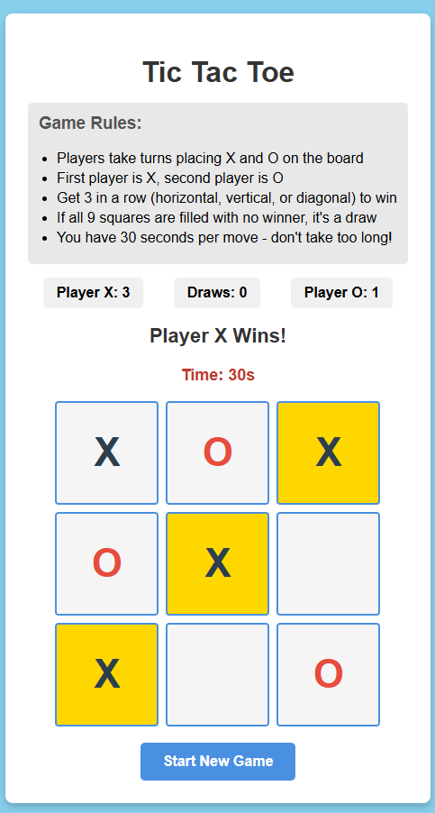

# Shachar's Tic Tac Toe Game Project!

A modern, interactive Tic Tac Toe game built for the first project in my web developement class, with JavaScript, HTML, and CSS. 
Hope you enjoy it!

## Game Screenshot:



## Game Features:

- **Two Player Gameplay**: Alternating turns between X and O, starting with X
- **Win Detection**: Automatically detects winning combinations
- **30-Second Timer**: Each player has 30 seconds per move
- **Score Tracking**: Keeps track of wins and draws for both players
- **Visual Feedback**: Highlights winning combinations
- **Draw Detection**: Recognizes when the board is full with no winner

## Game Rules:

1. Players take turns placing X and O on a 3x3 grid
2. First player uses X, second player uses O
3. Get 3 marks in a row (horizontal, vertical, or diagonal) to win the game
4. If all 9 squares are filled with no winner, the game is a draw
5. Each player has 30 seconds to make a move
6. If time runs out, the current player loses

## How to Play?

1. Open `index.html` in your web browser
2. Player X goes first - click any square to place your mark
3. Players alternate turns automatically
4. Watch the timer - don't run out of time!
5. First to get 3 in a row wins
6. Click "Start New Game" to play again

## Tic Tac Toe Project Structure:

    index.html - Main HTML file with using also CSS and JavaScript
    README.md - This file that explains the project
    screenshot.png - Screenshot of the appearance of the game

## Technologies Used:

- **HTML5**: for the Structure and layout of the project
- **CSS3**: for the Styling, animations, and responsive design of the game
- **JavaScript (ES6)**: for the Game logic, timer, and interactivity of the game

## How to run my project?

1. Clone this repository:
   ```bash
   git clone https://github.com/yourusername/tic-tac-toe.git
   ```

2. Navigate to the project directory:
   ```bash
   cd tic-tac-toe
   ```

3. Open `index.html` in your browser:
   - Double-click the file, or
   - Right-click and select "Open with" your preferred browser

## Game Features Breakdown:

### Timer
- 30-second countdown for each players move
- Visual warning when time for a move is running out - turns red at 10 seconds
- Automatic game over announcement if the timer reaches zero

### Score Tracking
- Persistent score across multiple games
- Tracks wins for Player X, Player O, and draws for both players
- Displays the scores at the top of the game board

### Win Detection
- Checks all 8 possible winning combinations
- Highlights winning squares with animation
- Announces the winner clearly

### User Interface
- Modern gradient background
- Smooth hover effects on squares
- Responsive button design
- Clear status messages

## Project Coding Highlights:

The game uses several key programming concepts:

**HTML Structure & DOM (Document Object Model):**
- The **DOM** is how JavaScript sees and interacts with the HTML page - it's like a tree structure where each HTML element is a branch that JavaScript can access and modify
- Uses semantic HTML with `<div>` elements to create the game board structure
- Each square has a `data-index` attribute (0-8) - these are custom HTML attributes that store extra information JavaScript can read later
- JavaScript accesses these elements using `document.getElementById()` to find specific elements by their ID

**CSS Styling & Layout:**
- **CSS Grid** is a layout system that arranges elements in rows and columns - I used `grid-template-columns: repeat(3, 120px)` which creates 3 columns of 120 pixels each for the 3×3 board
- **Pseudo-classes** like `:hover` are special CSS selectors that apply styles when something happens (like hovering your mouse over a square)
- **CSS animations** use `@keyframes` to define how something should move or change over time - the winning squares pulse by growing and shrinking repeatedly
- Uses **flexbox** (flexible box layout) to center content and **linear gradients** for the colorful background

**JavaScript Core Concepts:**

- **Variables & Data Types:** 
  - **Variables** are like labeled boxes that store information
  - `let` declares variables that can change value (like `currentPlayer` which switches from 'X' to 'O')
  - `const` declares variables whose reference stays the same (like `squares` which always points to the same 9 square elements)
  - **Arrays** are ordered lists - `gameBoard = ['', '', '', '', '', '', '', '', '']` stores what's in each of the 9 squares
  - **Objects** store related data as key-value pairs - `scores = {X: 0, O: 0, draws: 0}` keeps track of wins for each player

- **Event Listeners:** 
  - **Event listeners** "listen" for specific actions (like clicks) and run code when they happen
  - `addEventListener('click', handleSquareClick)` tells JavaScript: "When this square is clicked, run the handleSquareClick function"
  - This is **event-driven programming** - the program waits for user actions rather than running everything at once

- **Functions:**
  - **Functions** are reusable blocks of code that perform specific tasks
  - `function makeMove(square, index) { ... }` is a function that takes two **parameters** (inputs) and executes when called

- **Conditional Logic (if/else statements):**
  - **Conditionals** make decisions - they run different code depending on whether something is true or false
  - `if (gameBoard[clickedIndex] !== '')` checks: "Is this square already taken?"
  - The code inside `{ }` only runs if the condition is true

- **Loops:**
  - **Loops** repeat code multiple times automatically
  - `for (let i = 0; i < 8; i++)` creates a **for loop** that runs 8 times (once for each winning condition)
  - `i++` means "add 1 to i" after each loop
  - `forEach(square => { ... })` is a special loop that runs code for each item in an array - here it adds click listeners to all 9 squares

- **DOM Manipulation:**
  - **DOM Manipulation** means changing what appears on the webpage using JavaScript
  - `document.getElementById('status')` finds an HTML element by its ID attribute
  - `querySelectorAll('.square')` finds all elements with class "square"
  - `textContent` property changes the text inside an element - `square.textContent = 'X'` displays an X
  - `classList.add('winner')` adds a CSS class to an element, which changes how it looks

- **Timers (Asynchronous JavaScript):**
  - `setInterval(function, milliseconds)` repeatedly runs a function at fixed time intervals
  - `setInterval(() => { timeLeft--; }, 1000)` runs every 1000 milliseconds (1 second) and decreases timeLeft by 1
  - This is **asynchronous** - the timer runs in the background while the rest of the code continues working
  - `clearInterval()` stops the timer when needed (like when the game ends)

- **Ternary Operators:**
  - A **ternary operator** is shorthand for an if/else statement: `condition ? valueIfTrue : valueIfFalse`
  - `currentPlayer = currentPlayer === 'X' ? 'O' : 'X'` means: "If currentPlayer is X, change it to O, otherwise change it to X"

- **Boolean Logic:**
  - **Booleans** are true/false values - the simplest data type
  - `let gameActive = true` stores whether the game is still running
  - **Logical operators** combine conditions: `&&` (AND), `||` (OR), `!` (NOT)
  - `if (!gameActive || gameBoard[index] !== '')` means: "If game is NOT active OR square is taken"
  - This allows checking multiple conditions in one statement

- **Array Methods & Iteration:**
  - `.includes('')` checks if an array contains a specific value - used to detect if any squares are empty (for draw detection)
  - `.forEach()` is an **array method** that performs an action on each element
  - Arrays are **zero-indexed**, meaning the first item is at position 0, not 1
```

## Game Customization

The game was customized using:

- **Colors**: Change the gradient in the CSS `body` selector
- **Timer Duration**: Adjust `timeLeft = 30` in the JavaScript
- **Board Size**: Modify the grid in CSS (currently 120px squares)
- **Animations**: Update the `@keyframes pulse` animation

## This project demonstrates:

- DOM manipulation and event handling
- Game state management
- Timer implementation with JavaScript
- Responsive CSS design
- Algorithmic thinking (win detection logic)
- User experience design

## Project Author

**Shachar Cohen Sharon**
- GitHub: [@yourusername](https://github.com/yourusername)
- Email: Shachari07sharon@gmail.com

---


